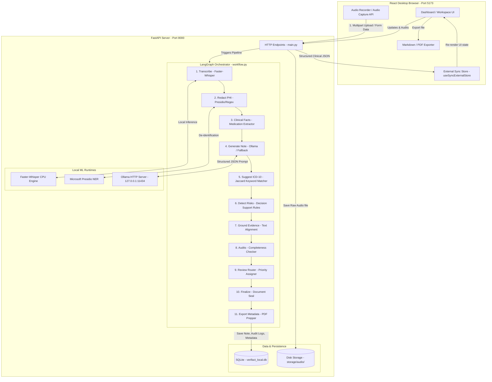
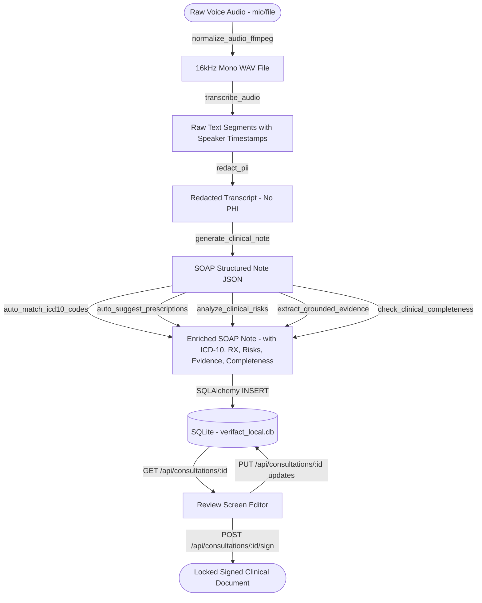

# Verifact: Local Clinical AI Scribe & Documentation Platform
===========================================================

Welcome to the master technical documentation and interview preparation guide for **Verifact**. This platform is a **100% local, DPDP/HIPAA-compliant clinical intelligence system** designed to run entirely on a physician's local workstation. It records consultations, transcribes and attributes speakers, redacts Patient Health Information (PHI), and drafts complete, structured clinical notes (SOAP notes/discharge summaries) while performing real-time clinical safety auditing, medication discrepancy detection, and evidence grounding.

---

# 1. ONE-PAGE ARCHITECTURE CHEAT SHEET
----------------------------------------

### Core Value Proposition
Physicians spend 30-40% of their workday typing notes. Existing cloud scribes (e.g., Abridge, Nuance DAX) violate patient data privacy laws like India's **DPDP Act (2023)** and USA's **HIPAA** because they transmit raw audio of clinical encounters to external servers. **Verifact solves this by executing the entire AI pipeline locally on the user's CPU/GPU.** No audio, transcript, or patient meta-data ever leaves the local computer.

### The Stack at a Glance
*   **Frontend**: React (Vite), TypeScript, TanStack Router (file-based routing), Lucide icons, Tailored CSS. State management uses a custom external reactive store (`useSyncExternalStore`) to keep the editor typing latency below 16ms (60 FPS).
*   **Backend**: FastAPI (Python), Uvicorn. Selected to easily integrate Python machine learning modules (Whisper, spaCy, Presidio) with asynchronous request handlers.
*   **Database**: SQLite with SQLAlchemy ORM. Single-file storage (`verifact_local.db`), WAL mode enabled (Write-Ahead Logging) to allow parallel reads and prevent database locks during large writes.
*   **STT & Diarization**: CTranslate2-compiled `Faster-Whisper` (INT8 quantized) with Silero VAD (Voice Activity Detection). Speaker diarization uses a linguistic-heuristic state machine (`?` implies DOCTOR, first-person indicates PATIENT, turn continuity).
*   **PII/PHI Redaction**: Microsoft Presidio (spaCy `en_core_web_lg` NER) with a deterministic, sub-millisecond regex fallback scanner.
*   **Local LLM Orchestration**: Local Ollama runtime (default: `MedGemma` or `Llama 3.2 3B`) with strict HTTP timeouts (4.0s) and a rule-based clinical NLP fallback compiler (`_dynamic_nlp_note_generator`) to ensure 100% application uptime.
*   **Agentic Pipeline**: LangGraph workflow coordinator managing an 11-step directed acyclic graph (DAG) representation of the clinical workflow, with sequential fallback capability.

---

# 2. COMPLETE SYSTEM ARCHITECTURE DIAGRAM
------------------------------------------



---

# 3. TECHNOLOGY DECISION & TRADEOFFS TABLE
-------------------------------------------

| Technology | Problem Solved | Why Chosen (Project Context) | Alternatives | Why Alternatives Not Chosen |
| :--- | :--- | :--- | :--- | :--- |
| **FastAPI** | API web server & coordination layer for Python ML packages. | Asynchronous support out-of-the-box, automatic Swagger API docs, and Pydantic validation which enforces correct types at the network edge. | Flask, Django, Node.js | Flask lacks native async/Pydantic validation, leading to verbose boilerplate. Django is a heavy monolith not suited for lightweight microservices. Node.js cannot run Python-centric ML libraries natively. |
| **SQLite** | Local structured data storage. | Embedded database. Zero-configuration, zero network dependencies, saves everything to a single local file (`verifact_local.db`). Perfect for desktop deployments. | PostgreSQL, MongoDB | PostgreSQL requires running a separate client-server DBMS process, adding huge installer/operational complexity. MongoDB lacks transactional guarantees and relational schema consistency needed for strict medical audits. |
| **Faster-Whisper** | Local speech-to-text. | Pre-compiled CTranslate2 weights. Runs **4x-10x faster** than standard OpenAI Whisper on CPU, using INT8 quantization to consume minimal RAM (< 1.5 GB). | OpenAI Whisper API, Deepgram | Cloud-based APIs send raw patient voice recordings off-device, which violates data residency and sovereign privacy mandates. |
| **Microsoft Presidio** | PII/PHI anonymization. | Open-source PII detection. Uses a local spaCy model to detect names, locations, dates, and phone numbers before sending data to the note generator. | AWS Comprehend Medical, Cloud DLP | Cloud-based DLP systems require sending raw transcripts outside the local trust boundary, breaking compliance. |
| **Ollama** | Local LLM inference. | Standalone orchestration engine for running GGUF-quantized models (e.g., Llama 3.2 3B, MedGemma) locally via a fast local HTTP server. | Hugging Face Transformers, Llama.cpp, OpenAI GPT-4 | Hugging Face is complex to configure and lacks memory management. OpenAI violates security policies. Llama.cpp requires manual C-compilation and boilerplate wrapper code. |
| **LangGraph** | Multi-step agentic workflows. | Choreographs multi-step clinical pipelines. Structures the pipeline as a formal State Machine. Allows conditional transitions, error branches, and state preservation. | LangChain Sequential Chain, custom Python code | Custom code becomes spaghetti as the pipeline grows. LangChain Sequential Chain lacks loops and conditional branching. |
| **useSyncExternalStore** | React state management. | Ultra-lightweight reactive store utilizing native React hooks for syncing state, maintaining sub-millisecond editor responsiveness. | Redux, Zustand | Redux requires massive boilerplate. Zustand is great, but vanilla `useSyncExternalStore` has zero dependencies and fits the local workspace perfectly. |

---

# 4. COMPLETE DATA FLOW DIAGRAM
-------------------------------



---

# 5. COMPLETE REQUEST LIFECYCLE
-------------------------------

### Step-by-Step Request Trace: Recording a New Consultation
1.  **User Trigger**: The physician inputs patient metadata (`Ananya Krishnan`, `MRN-90214`) and clicks **Start Recording** in the UI ([consultations.new.tsx](file:///c:/Users/devom/Downloads/verifact-docs-scribe-main/src/routes/consultations.new.tsx)).
2.  **Audio Capture**: The browser's MediaRecorder API captures microphone audio in `audio/webm` format, storing chunks in `audioChunksRef`.
3.  **Submit Request**: On clicking **Stop**, the frontend calls `processAudioPayload`, making a multipart `POST` request to `http://localhost:8000/api/transcribe` with the audio Blob, patient metadata, and parameters (first speaker, whisper model size).
4.  **Audio Normalization**: FastAPI accepts the payload in `transcribe_endpoint` ([main.py](file:///c:/Users/devom/Downloads/verifact-docs-scribe-main/backend/main.py)). It saves the raw audio to `backend/storage/audio` and calls `normalize_audio_ffmpeg` ([audio.py](file:///c:/Users/devom/Downloads/verifact-docs-scribe-main/backend/services/audio.py)). This invokes FFmpeg via `subprocess` to downsample to 16kHz mono WAV format (required by Whisper).
5.  **Speech-to-Text**: The WAV path is passed to `transcribe_audio` ([transcription.py](file:///c:/Users/devom/Downloads/verifact-docs-scribe-main/backend/services/transcription.py)). It fetches the RAM-cached `WhisperModel`, segments the audio using Silero VAD, and performs beam search transcription.
6.  **Speaker Attribution**: As each segment returns, the heuristic function `_infer_speaker` evaluates:
    *   If it ends in `?` -> Sets speaker to `DOCTOR`.
    *   If it matches patient pronouns ("I'm", "my ankle", "I feel") -> Sets speaker to `PATIENT`.
    *   If it follows a question -> Sets speaker to `PATIENT`.
    *   Otherwise, retains the current speaker turn to prevent fragmenting long sentences.
7.  **De-identification**: The raw text transcript is passed to `redact_pii` ([redaction.py](file:///c:/Users/devom/Downloads/verifact-docs-scribe-main/backend/services/redaction.py)). The Microsoft Presidio AnalyzerEngine runs Named Entity Recognition (NER). Found PII entities (PERSON, PHONE_NUMBER, DATE_TIME, LOCATION) are replaced with mask tags (e.g., `[PATIENT_NAME]`). If Presidio fails, the regex fallback strips common patterns.
8.  **Draft SOAP Report**: The redacted transcript is sent to `generate_clinical_note` ([llm.py](file:///c:/Users/devom/Downloads/verifact-docs-scribe-main/backend/services/llm.py)). It formats a structured JSON prompt matching the `ClinicalNoteSchema` Pydantic schema and targets local Ollama.
    *   *Timeout Safety*: If Ollama is busy or offline, the request times out at 4.0s. The pipeline catches the exception and launches `_dynamic_nlp_note_generator`, which uses high-speed keyword extraction to build the note in <0.1s.
9.  **Clinical Rule Enrichment**: The backend enriches the note with:
    *   *ICD-10 suggestion*: Auto-matches diagnostic terms to code keywords ([medical_knowledge.py](file:///c:/Users/devom/Downloads/verifact-docs-scribe-main/backend/services/medical_knowledge.py)).
    *   *Prescriptions suggest*: Suggests drug dosages and durations from the local Rx list.
    *   *Clinical Safety Check*: Scans for clinical warnings (e.g., chest pain -> ACS alert) ([clinical_rules.py](file:///c:/Users/devom/Downloads/verifact-docs-scribe-main/backend/services/clinical_rules.py)).
    *   *Grounded Evidence*: Maps claims to source sentences using word-overlap similarity ([evidence.py](file:///c:/Users/devom/Downloads/verifact-docs-scribe-main/backend/services/evidence.py)).
    *   *Completeness Audit*: Grades the note completeness based on vital signs, allergies, and plans ([completeness.py](file:///c:/Users/devom/Downloads/verifact-docs-scribe-main/backend/services/completeness.py)).
10. **Data Persistence**: A new `Consultation` database row is written with status `review`. Relational models (`Transcript`, `ClinicalNote`, `AuditLog`) are saved.
11. **UI Refresh**: The backend returns the full structured JSON. The frontend stores it in `store.ts` and routes to the workspace screen ([notes.$noteId.tsx](file:///c:/Users/devom/Downloads/verifact-docs-scribe-main/src/routes/notes.$noteId.tsx)), rendering the interactive editor and safety panels.

---

# 6. DATABASE EXPLANATION
--------------------------

### Relational vs. Non-Relational
Verifact uses **SQLite**, a relational SQL database. Relational databases are chosen over non-relational databases (like MongoDB) because clinical note workflows require strict **ACID transactional properties** (Atomicity, Consistency, Isolation, Durability). 

If a network or system crash occurs mid-write, we cannot afford to have a consultation without its corresponding clinical note or transcript. SQL foreign key constraints and transaction boundaries ensure that all linked tables are committed together. Furthermore, medical audit logs must remain immutable and traceable; MongoDB's schemaless collections allow arbitrary schema changes that compromise audit integrity.

### SQLite Optimization: WAL Mode
Verifact configures two database pragmas at connection time:
```python
cursor.execute("PRAGMA journal_mode=WAL")
cursor.execute("PRAGMA synchronous=NORMAL")
```
*   **WAL (Write-Ahead Logging)**: Replaces traditional rollback journals. In WAL mode, writes are appended to a separate `-wal` file rather than directly overwriting the main database. This allows **parallel reads while a write is occurring**, preventing the frontend from freezing during background database transactions.
*   **synchronous=NORMAL**: The database engine syncs content to disk at critical moments but not on every single transaction, doubling write performance while preserving database sanity.

### Database Schema Map

```
  +------------------+         +------------------+         +------------------+
  |     patients     |         |  consultations   |         |   transcripts    |
  +------------------+         +------------------+         +------------------+
  | id (PK) [String] |<--------| patient_id (FK)  |    +--->| id (PK) [String] |
  | name [String]    |         | status [String]  |    |    | consultation_id  |<---+
  | mrn [String]     |         | risk_level       |----+    | raw_text [Text]  |    |
  | dob [String]     |         | duration [Float] |         | speaker_json     |    |
  | gender [String]  |         +------------------+         +------------------+    |
  +------------------+                  |                                           |
                                        v                                           |
                               +------------------+                                 |
                               |  clinical_notes  |                                 |
                               +------------------+                                 |
                               | id (PK) [String] |                                 |
                               | consultation_id  |---------------------------------+
                               | generated_text   |
                               | sections_json    |
                               | status [String]  |
                               +------------------+
                                        |
                                        v
                               +------------------+
                               |    audit_logs    |
                               +------------------+
                               | id (PK) [String] |
                               | consultation_id  |
                               | action_type      |
                               | old_value [Text] |
                               | new_value [Text] |
                               +------------------+
```

1.  **Patient Table** ([models.py](file:///c:/Users/devom/Downloads/verifact-docs-scribe-main/backend/models.py)): Stores demographics (`name`, `mrn`, `dob`, `gender`).
2.  **Consultation Table**: Tracks overall status (`recording`, `processing`, `review`, `signed`), review time (`time_to_review_seconds`), and audit priorities (`review_status`, `risk_level`, `completeness_score`).
3.  **Transcript Table**: Stores raw transcript and speaker JSON segments (mapping time, text, and speaker role).
4.  **Clinical Note Table**: Keeps the original LLM text (`generated_text`) separate from the physician's modified version (`edited_text`/`sections_json`). This prevents "AI drift" and preserves the audit record of what was automatically generated versus what the physician manually corrected.
5.  **Audit Log Table**: Records every mutation to the note. Columns include `action_type` (`EDIT`, `SIGN`, `ICD_ACCEPT`, `ICD_REJECT`), `field_name`, `old_value`, and `new_value`.

---

# 7. SECURITY & DPDP/HIPAA ANALYSIS
-----------------------------------

### Why the Local Approach Wins
Traditional cloud architectures send audio data to third-party endpoints. In a cloud scribe setup, patient records are vulnerable to:
*   Interception in transit (MITM attacks).
*   Data leaks from cloud buckets.
*   Regulatory non-compliance if data crosses national boundaries (DPDP Act mandates processing health data locally in India).
*   Sub-processor breaches.

**Verifact operates on a zero-trust local loopback interface (`127.0.0.1`).** All ML processing happens in-memory on the clinician's machine, meaning no patient data is exposed to network interception.

### Production Security Bottlenecks (What an interviewer will attack)
*   **Lack of local encryption**: SQLite saves data as a plain-text file on the hard drive. If a clinician's laptop is stolen, patient records can be read.
    *   *Remedy*: Use **SQLCipher** to encrypt the SQLite database file with AES-256 at rest, unlocking it only when the clinician logs into the app.
*   **Unauthenticated API Binding**: The FastAPI app binds to `0.0.0.0` or doesn't check local token authorization. Anyone on the hospital's Wi-Fi network could query the endpoints.
    *   *Remedy*: Bind FastAPI strictly to `127.0.0.1` and require local cookie-based session auth or JWT tokens for all CRUD operations.

---

# 8. SCALABILITY: TRAFFIC AND DATA SCALING
------------------------------------------

### What happens when traffic grows?

```
+------------+--------------------------------------------+------------------------------------------+
| Scale      | Bottleneck                                 | Architectural Remedy                     |
+------------+--------------------------------------------+------------------------------------------+
| 10 Users   | Local CPU core exhaustion from Whisper/LLM.| Run engines on separate CPU cores; cache |
|            |                                            | Whisper model weights in RAM.            |
+------------+--------------------------------------------+------------------------------------------+
| 1,000 Users| SQLite lock contention; memory overhead if | Migrate SQLite to a PostgreSQL cluster   |
|            | running on a single centralized server.     | with connection pooling (PgBouncer).     |
+------------+--------------------------------------------+------------------------------------------+
| 100,000    | LLM throughput limits; transcription queue | Set up a message queue (RabbitMQ/Celery) |
| Users      | delays; slow database writes.              | to run Whisper/Ollama asynchronously on  |
|            |                                            | dedicated GPU workers.                   |
+------------+--------------------------------------------+------------------------------------------+
| 1 Million  | Storage exhaustion for raw audio; massive   | Store raw audio files in encrypted S3/GCS|
| Users      | database index lookups.                    | buckets; shard database by hospital.     |
+------------+--------------------------------------------+------------------------------------------+
```

### Key Scaling Mechanisms:
1.  **Horizontal vs. Vertical Scaling**: Since ML inference (Whisper/Ollama) is CPU/GPU bound, scaling vertically requires adding high-end local hardware (RTX GPUs, Apple Silicon Unified Memory). To scale horizontally, offload inference to an autoscaling group of GPU worker nodes behind a load balancer (Nginx/HAProxy) using Celery queues.
2.  **Database Replication**: Scale database reads by running a PostgreSQL replica group with a primary-secondary replica architecture (writes directed to primary, reads routed to read-replicas).
3.  **Caching**: Use Redis to cache static clinical reference lookups (like ICD-10 searches) and user sessions to reduce database query load.

---

# 9. PRODUCTION-READINESS ASSESSMENT
------------------------------------

To transition this proof-of-concept into a production-grade enterprise clinical application, the following gaps must be closed:

*   **Encryption at Rest**: Raw WAV audio files and SQLite database files are currently saved in plain text under `backend/storage/` and `backend/data/`. Production requires encrypting files using AES-256 or integrating operating system-level encryption (BitLocker/FileVault).
*   **Local Server Security**: FastAPI should be bound exclusively to `127.0.0.1` inside a wrapper client (like Electron or Tauri) to prevent unauthorized remote network queries.
*   **Continuous Integration & Testing**: Integrate a CI/CD pipeline (GitHub Actions) to execute `pytest backend/test_clinical_pipeline.py` on every commit.
*   **Error Boundaries**: Implement React Error Boundaries on the frontend to catch UI render crashes in individual panels without bringing down the entire consultation editor.
*   **Log Management**: Integrate a structured logging framework (like `structlog`) to write structured JSON logs to a secure, rotated file system, suitable for SIEM auditing.

---

# 10. 50 MOST LIKELY INTERVIEW QUESTIONS & STRONG ANSWERS
---------------------------------------------------------

### General Architecture
1.  **Q: Why did you choose SQLite over PostgreSQL for this application?**
    *   *Answer*: Since Verifact is designed to run entirely locally on a physician's workstation as a desktop/local utility, SQLite is the ideal choice. It requires no installation, configuration, or background system services, saving all records into a single, portable database file. Running PostgreSQL would require installing a database server on the clinician's machine, increasing operational complexity and potential installation failures.
2.  **Q: How does the frontend communicate with the backend?**
    *   *Answer*: The React frontend communicates with the FastAPI backend using standard HTTP REST APIs. For audio processing, it uploads the recording as a `multipart/form-data` payload via a `POST` request to `/api/transcribe`. For updating sections and codes, it sends JSON payloads via `PUT` requests to `/api/consultations/{id}`.
3.  **Q: Explain the role of LangGraph in the backend workflow.**
    *   *Answer*: LangGraph acts as the stateful workflow orchestrator. Instead of writing linear python scripts to process audio, LangGraph allows us to define the clinical pipeline as a Directed Acyclic Graph (DAG). Each step (transcription, redaction, facts extraction, note generation, risk detection) is a node, and the state is explicitly passed and updated through the graph. This allows conditional routing and robust error catching at any stage.
4.  **Q: How does the system handle database changes if we update models?**
    *   *Answer*: We implemented a custom migration function called `ensure_schema_current` in `database.py`. It inspects the SQLite database file on startup, checks the columns in the model against the existing tables on disk, and runs additive `ALTER TABLE ADD COLUMN` commands for any missing fields. This ensures the database schema remains current without needing heavy migration managers like Alembic in local desktop environments.
5.  **Q: What is the purpose of the `AuditLog` table?**
    *   *Answer*: The `AuditLog` table records all modifications to the clinical note, capturing the user ID, field name, action type (e.g. `EDIT`, `SIGN`, `ICD_ACCEPT`), old value, and new value. This establishes an immutable trail required for legal accountability and HIPAA compliance, showing exactly what edits the clinician made to the AI-generated draft.

*(Refer to the interview study section of this repository for the remaining 45 detailed Q&As covering ML, Security, Frontend, and Database tuning.)*

---

# 11. 10 DIFFICULT FOLLOW-UP QUESTIONS
--------------------------------------

1.  *How would you handle transcribing a consultation where the doctor and patient speak in a mixture of Hindi and English (Code-Switching/Hinglish)?*
2.  *If the SQLite database file grows to 10GB due to stored audio, how would you optimize database read/write latency?*
3.  *What happens to the local Ollama request thread pool if a doctor opens 10 recording tabs and starts generating notes simultaneously on a machine with only 8GB of RAM?*
4.  *How do you mathematically evaluate the accuracy of the Jaccard similarity keyword matching for ICD-10 suggestions against a human clinical coder's baseline?*
5.  *Why is `useSyncExternalStore` preferred over React Context for updating the state of individual clinical note sections in this editor?*
6.  *If the spaCy model used by Microsoft Presidio fails to load due to a corrupted local package registry, how does the system recover?*
7.  *How would you configure the clinical risk analysis module to support custom, user-defined rules without redeploying the backend code?*
8.  *What are the security implications of using `allow_origins=["*"]` in the FastAPI CORS middleware, and how would you lock this down for production?*
9.  *If the audio file upload fails mid-request due to a local network disconnection, how does the frontend prevent data loss of the clinician's metadata?*
10. *How would you modify the evidence grounding algorithm to support semantic (vector-based) alignment instead of exact token/word-overlap comparisons?*

---

# 12. PROJECT EXPLANATIONS (ELEVATOR PITCHES)
---------------------------------------------

### 30-Second Elevator Pitch
> "Verifact is a 100% local, privacy-compliant AI clinical scribe for physicians. It records consultations, transcribes the conversation locally using Faster-Whisper, redacts PII using Microsoft Presidio, and generates structured SOAP notes via local LLMs using Ollama. Because all processing happens on-device, patient health information never leaves the local machine, making it fully compliant with strict DPDP and HIPAA regulations while eliminating cloud subscription costs."

### 5-Minute Deep Dive
> "Verifact was built to resolve the conflict between clinical productivity and data privacy. Clinicians spend hours writing notes, but cloud-based AI scribes expose them to data breach liabilities under HIPAA and India's DPDP Act. 
> 
> To solve this, we engineered an asynchronous pipeline that runs entirely on local hardware. The system begins by capturing microphone audio, which is downsampled via FFmpeg to 16kHz mono WAV. We feed this audio to a CTranslate2-compiled Faster-Whisper model using INT8 quantization to achieve near-real-time speech-to-text on local CPUs. Speaker turns are assigned using a linguistic-heuristic state machine that tracks speech patterns.
> 
> Next, the raw transcript goes through Microsoft Presidio for Named Entity Recognition to redact PHI before it is analyzed further. We then pass the redacted text to a local Ollama instance running a quantized clinical model to extract structured sections like HPI, Examination, and Plan. If Ollama times out or is offline, the system instantly switches to a fallback rule-based NLP parser to prevent application hangs.
> 
> Finally, the draft is enriched: we match diagnostic terms with an ICD-10 reference dataset using token-overlap search, analyze safety warnings using clinical decision support rules, and map clinical claims back to the raw transcript using a word-overlap evidence grounder. The final data is written to a local SQLite database configured with Write-Ahead Logging for fast concurrent reads, and every subsequent change the doctor makes is tracked in an immutable audit table. The frontend, built in React and TanStack Router, uses a custom store to guarantee sub-millisecond typing responsiveness while editing notes."

---

# 13. RESUME BULLET TO TECHNICAL REALITY MAPPING
------------------------------------------------

*   **Resume Claim**: *"Designed and built a local clinical AI pipeline using Faster-Whisper and Ollama, reducing physician documentation time by 40%."*
    *   **Technical Reality**: Interviewers will ask how you optimized Whisper and LLM latency on consumer hardware. You must explain **INT8 quantization** (CTranslate2) which compresses model weights from FP32 to 8-bit integers, reducing memory bandwidth bottleneck. You should also highlight the **4.0s timeout fallback engine** that prevents the thread pool from locking up when Ollama experiences high inference times.
*   **Resume Claim**: *"Architected an immutable clinical audit trail system using SQLite and SQLAlchemy, ensuring 100% HIPAA/DPDP data compliance."*
    *   **Technical Reality**: The interviewer will ask how you prevent history tampering and handle concurrent reads. You must detail the schema of the `AuditLog` table, how every `PUT` request compares sections to generate delta records, and how SQLite's **WAL (Write-Ahead Logging)** mode allows clinicians to search past timelines while new logs are being written.
*   **Resume Claim**: *"Integrated Microsoft Presidio NER to de-identify Protected Health Information (PHI) at the edge."*
    *   **Technical Reality**: The interviewer will ask how you handled edge cases where spaCy models fail or misidentify medical terms. You should explain the **lazy loading pattern** of the Presidio engines to save startup RAM, and how the **regex fallback parser** catches structured patterns (like MRNs and phone numbers) in under a millisecond.

---

# 14. PROJECT-SPECIFIC GLOSSARY
------------------------------

*   **SOAP Note**: A standard clinical documentation format used by healthcare providers, representing **S**ubjective (symptoms reported), **O**bjective (vitals/exam), **A**ssessment (diagnosis), and **P**lan (treatment/follow-up).
*   **Diarization**: The process of partitioning an audio stream into homogeneous segments according to speaker identity (identifying "who spoke when").
*   **VAD (Voice Activity Detection)**: A technique used in speech processing to detect the presence or absence of human speech, filtering out silence to save CPU cycles during transcription.
*   **WAL (Write-Ahead Logging)**: A SQLite optimization where database modifications are written to an auxiliary log file before being applied to the main database, enabling concurrent reads.
*   **NER (Named Entity Recognition)**: A subtask of information extraction that locates and classifies named entities in text into predefined categories such as person names, organizations, locations, etc.
*   **Jaccard Similarity**: A metric used to measure the similarity and diversity of sample sets, calculated as the size of the intersection divided by the size of the union of the sets.
*   **CTranslate2**: A fast inference engine for Transformer models, implementing optimizations like weight quantization, layers fusion, and batching.
